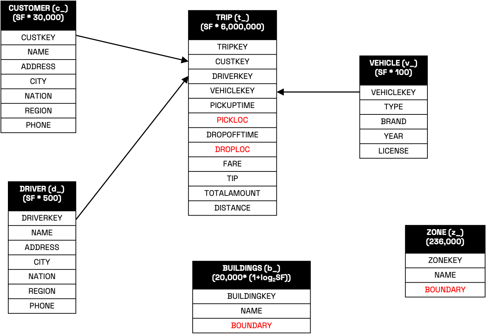
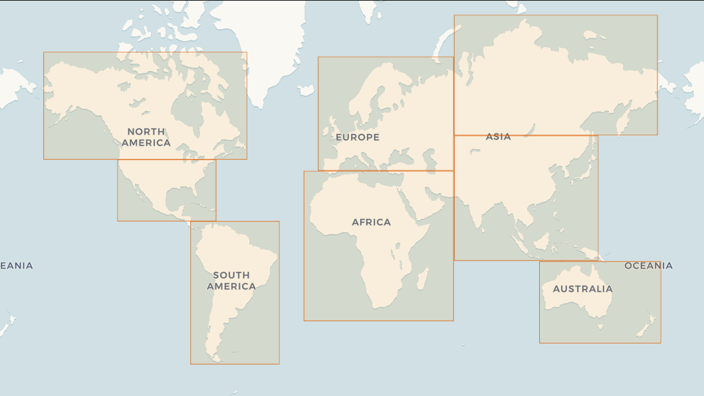

# SpatialBench

SpatialBench is a high-performance geospatial benchmark for generating synthetic spatial data at scale. Inspired by the Star Schema Benchmark (SSB) and real-world mobility data like the NYC TLC dataset, SpatialBench is designed to evaluate spatial query performance in modern data platforms.

Built in Rust and powered by Apache Arrow, SpatialBench brings fast, scalable, and streaming-friendly data generation for spatial workloads—minimal dependencies, blazing speed.

SpatialBench provides a reproducible and scalable way to evaluate the performance of spatial data engines using realistic synthetic workloads.

Goals:

- Establish a fair and extensible benchmark suite for spatial data processing.
- Help users compare engines and frameworks across different data scales.
- Support open standards and foster collaboration in the spatial computing community.

## Data Model

SpatialBench defines a spatial star schema with the following tables:

| Table      | Type         | Abbr. | Description                                 | Spatial Attributes        | Cardinality per SF             |
|------------|--------------|-------|---------------------------------------------|----------------------------|--------------------------------|
| Trip       | Fact Table   | `t_`  | Individual trip records                     | pickup & dropoff points    | 6M × SF                        |
| Customer   | Dimension    | `c_`  | Trip customer info                          | None                       | 30K × SF                       |
| Driver     | Dimension    | `s_`  | Trip driver info                            | None                       | 500 × SF                       |
| Vehicle    | Dimension    | `v_`  | Trip vehicle info                           | None                       | 100 × SF                       |
| Zone       | Dimension    | `z_`  | Administrative zones (SF-aware scaling)     | Polygon                    | Tiered by SF range (see below) |
| Building   | Dimension    | `b_`  | Building footprints                         | Polygon                    | 20K × (1 + log₂(SF))           |

### Zone Table Scaling

The Zone table uses **scale factor–aware generation** so that zone granularity scales with dataset size and keeps query cost realistic. At small scales, this feels like querying ZIP-level units; at large scales, it uses coarser administrative units.

| Scale Factor (SF) | Zone Subtypes Included                     | Zone Cardinality |
|-------------------|--------------------------------------------|------------------|
| [0, 10)           | microhood, macrohood, county               | 156,095          |
| [10, 100)         | + neighborhood                             | 455,711          |
| [100, 1000)       | + localadmin, locality, region, dependency | 1,035,371        |
| [1000+)           | + country                                  | 1,035,749        |

This tiered scaling reflects **geometry complexity** and **area distributions** observed in the Overture `division_area` dataset which represents administrative boundaries, release version 2025-08-20.1.



### Geographic Coverage

Spatial Bench's data generator uses **continent-bounded affines**. Each continent is defined by a bounding polygon, ensuring generation mostly covers land areas and introducing the natural skew of real geographies.

Bounding polygons:

```text
Africa:              POLYGON ((-20.062752 -40.044425, 64.131567 -40.044425, 64.131567 37.579421, -20.062752 37.579421, -20.062752 -40.044425))
Europe:              POLYGON ((-11.964479 37.926872, 64.144374 37.926872, 64.144374 71.82884, -11.964479 71.82884, -11.964479 37.926872))
South Asia:          POLYGON ((64.58354 -9.709049, 145.526096 -9.709049, 145.526096 51.672557, 64.58354 51.672557, 64.58354 -9.709049))
North Asia:          POLYGON ((64.495655 51.944267, 178.834704 51.944267, 178.834704 77.897255, 64.495655 77.897255, 64.495655 51.944267))
Oceania:             POLYGON ((112.481901 -48.980212, 180.768942 -48.980212, 180.768942 -10.228433, 112.481901 -10.228433, 112.481901 -48.980212))
South America:       POLYGON ((-83.833822 -56.170016, -33.904338 -56.170016, -33.904338 12.211188, -83.833822 12.211188, -83.833822 -56.170016))
South North America: POLYGON ((-124.890724 12.382931, -69.511192 12.382931, -69.511192 42.55308, -124.890724 42.55308, -124.890724 12.382931))
North North America: POLYGON ((-166.478008 42.681087, -52.053245 42.681087, -52.053245 72.659041, -166.478008 72.659041, -166.478008 42.681087))
```



## Performance

SpatialBench inherits its speed and efficiency from the tpchgen-rs project, which is one of the fastest open-source data generators available.

Key performance benefits:
- **Zero-copy, streaming architecture**: Generates data in constant memory, suitable for very large datasets.
- **Multithreaded from the ground up**: Leverages all CPU cores for high-throughput generation.
- **Arrow-native output**: Supports fast serialization to Parquet and other formats without bottlenecks.
- **Fast geometry generation**: The Spider module generates millions of spatial geometries per second, with deterministic output.

## How is SpatialBench dbgen built?

SpatialBench is a Rust-based fork of the tpchgen-rs project. It preserves the original’s high-performance, multi-threaded, streaming architecture, while extending it with a spatial star schema and geometry generation logic.

You can build the SpatialBench data generator using Cargo:

```bash
cargo build --release
```

Alternatively, install it directly using:

```bash
cargo install --path ./tpchgen-cli
```

### Notes

- The core generator logic lives in the tpchgen crate.
- Geometry-aware logic is in tpchgen-arrow and integrated via Arrow-based schemas.
- The spatial extension modules like the Spider geometry generator reside in the [spatial](https://github.com/wherobots/sedona-tpchgen/blob/main/tpchgen/src/spatial) directory.
- The generator supports output formats like .tbl and Apache Parquet via the Arrow writer.

For contribution or debugging, refer to the [ARCHITECTURE.md](https://github.com/wherobots/sedona-tpchgen/blob/main/ARCHITECTURE.md) guide.

## Usage

#### Generate All Tables (Scale Factor 1)

```bash
tpchgen-cli -s 1 --format=parquet
```

#### Generate Individual Tables

```bash
tpchgen-cli -s 1 --format=parquet --tables trip,building --output-dir sf1-parquet
```

#### Partitioned Output Example

```bash
for PART in $(seq 1 4); do
  mkdir part-$PART
  tpchgen-cli -s 10 --tables trip,building --output-dir part-$PART --parts 4 --part $PART
done
```

#### Custom Spider Configuration

You can override these defaults at runtime by passing a YAML file via the `--config` flag:

```bash
tpchgen-cli -s 1 --format=parquet --tables trip,building --config tpchgen-config.yml
```

If --config is not provided, SpatialBench checks for ./tpchgen-config.yml. If absent, it falls back to built-in defaults.

For reference, see the provided [tpchgen-config.yml](tpchgen-config.yml).

See [CONFIGURATION.md](./tpchgen-cli/CONFIGURATION.md) for more details about spatial data generation and the full YAML schema and examples.

## Acknowledgements
- [TPC-H](https://www.tpc.org/tpch/)
- [SpiderWeb: A Spatial Data Generator on the Web](https://dl.acm.org/doi/10.1145/3397536.3422351)
- [tpchgen-rs for inspiration and baseline performance](https://datafusion.apache.org/blog/2025/04/10/fastest-tpch-generator/)
