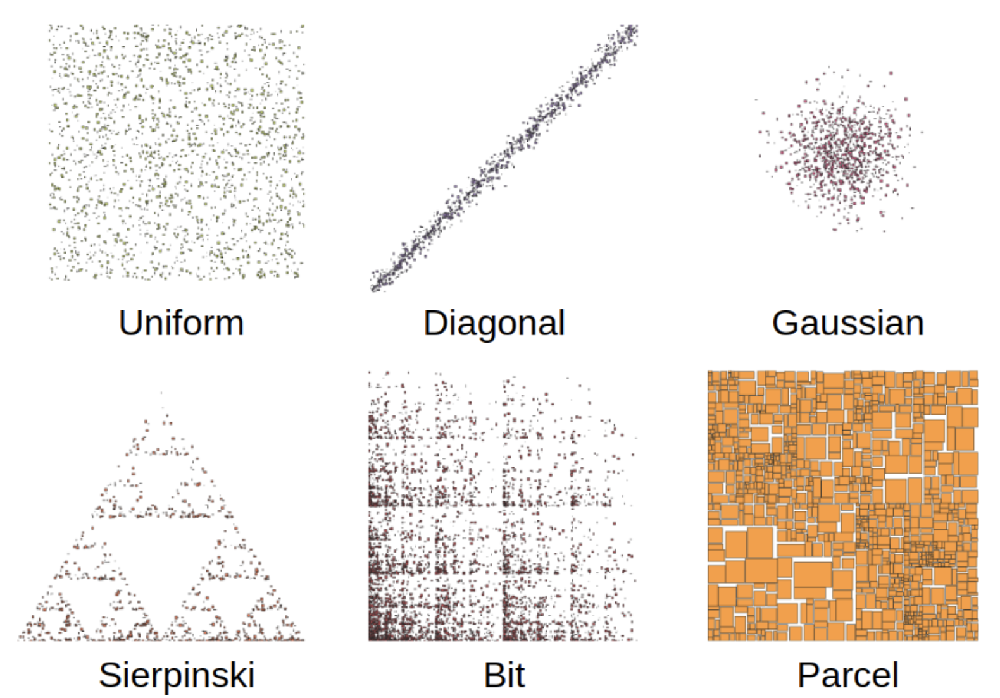

# SpatialBench

SpatialBench is a high-performance geospatial benchmark for generating synthetic spatial data at scale. Inspired by the Star Schema Benchmark (SSB) and real-world mobility data like the NYC TLC dataset, SpatialBench is designed to evaluate spatial query performance in modern data platforms.

Built in Rust and powered by Apache Arrow, SpatialBench brings fast, scalable, and streaming-friendly data generation for spatial workloads—minimal dependencies, blazing speed.

SpatialBench provides a reproducible and scalable way to evaluate the performance of spatial data engines using realistic synthetic workloads.

Goals:

- Establish a fair and extensible benchmark suite for spatial data processing.
- Help users compare engines and frameworks across different data scales.
- Support open standards and foster collaboration in the spatial computing community.

## Data Model

SpatialBench defines a spatial star schema with the following tables:

| Table      | Type         | Abbr. | Description                                 | Spatial Attributes        | Cardinality per SF       |
|------------|--------------|-------|---------------------------------------------|----------------------------|--------------------------|
| Trip       | Fact Table   | `t_`  | Individual trip records                     | pickup & dropoff points    | 6M × SF                  |
| Customer   | Dimension    | `c_`  | Trip customer info                          | None                       | 30K × SF                 |
| Driver     | Dimension    | `s_`  | Trip driver info                            | None                       | 500 × SF                 |
| Vehicle    | Dimension    | `v_`  | Trip vehicle info                           | None                       | 100 × SF                 |
| Zone       | Dimension    | `z_`  | Administrative zones                        | Polygon                    | ~236K (fixed)            |
| Building   | Dimension    | `b_`  | Building footprints                         | Polygon                    | 20K × (1 + log₂(SF))     |

!!!note

    Unlike other tables in the benchmark, the Zone table does not scale with the scale factor. It is a fixed-size reference table representing administrative boundaries and is derived from the Overture Maps Divisions theme, release version 2025-06-25.0.
    This ensures consistency and realism for spatial join workloads such as point-in-polygon or zone-based aggregations.


## Performance

SpatialBench inherits its speed and efficiency from the tpchgen-rs project, which is one of the fastest open-source data generators available.

Key performance benefits:
- **Zero-copy, streaming architecture**: Generates data in constant memory, suitable for very large datasets.
- **Multithreaded from the ground up**: Leverages all CPU cores for high-throughput generation.
- **Arrow-native output**: Supports fast serialization to Parquet and other formats without bottlenecks.
- **Fast geometry generation**: The Spider module generates millions of spatial geometries per second, with deterministic output and affine transforms.

## How is SpatialBench dbgen built?

SpatialBench is a Rust-based fork of the tpchgen-rs project. It preserves the original’s high-performance, multi-threaded, streaming architecture, while extending it with a spatial star schema and geometry generation logic.

You can build the SpatialBench data generator using Cargo:

```bash
cargo build --release
```

Alternatively, install it directly using:

```bash
cargo install --path .
```

### Notes

- The core generator logic lives in the tpchgen crate.
- Geometry-aware logic is in tpchgen-arrow and integrated via Arrow-based schemas.
- The spatial extension modules like the Spider geometry generator reside in [spider.rs](https://github.com/wherobots/sedona-spatialbench/blob/main/tpchgen/src/spider.rs).
- The generator supports output formats like .tbl and Apache Parquet via the Arrow writer.

For contribution or debugging, refer to the [ARCHITECTURE.md](https://github.com/wherobots/sedona-spatialbench/blob/main/ARCHITECTURE.md) guide.

## Usage

#### Generate All Tables (Scale Factor 1)

```bash
tpchgen-cli -s 1 --format=parquet
```

#### Generate Individual Tables

```bash
tpchgen-cli -s 1 --format=parquet --tables trip,building --output-dir sf1-parquet
```

#### Partitioned Output Example

```bash
for PART in $(seq 1 4); do
  mkdir part-$PART
  tpchgen-cli -s 10 --tables trip,building --output-dir part-$PART --parts 4 --part $PART
done
```

## SedonaBench Spider Data Generator

SpatialBench includes a synthetic spatial data generator ([spider.rs](https://github.com/wherobots/sedona-spatialbench/blob/main/tpchgen/src/spider.rs)) for creating:
- Points
- Rectangles (boxes)
- Polygons

This generator is inspired by techniques from the paper [SpiderWeb: A Spatial Data Generator on the Web](https://dl.acm.org/doi/10.1145/3397536.3422351) by Katiyar et al., SIGSPATIAL 2020.

### Supported Distribution Types

| Type         | Description                                                   |
|--------------|---------------------------------------------------------------|
| `UNIFORM`    | Uniformly distributed points in `[0,1]²`                      |
| `NORMAL`     | 2D Gaussian distribution with configurable `mu` and `sigma`   |
| `DIAGONAL`   | Points clustered along a diagonal                             |
| `BIT`        | Points in a grid with `2^digits` resolution                   |
| `SIERPINSKI` | Fractal pattern using Sierpinski triangle                     |



## Configuring Spider Geometry Generation

SpatialBench uses a flexible and extensible SpiderConfig struct (defined in Rust) to control how spatial geometries are generated for synthetic datasets. These configurations are defined in code, often using presets in spider_preset.rs.

#### SpiderConfig Fields

| Field | Type               | Description                                                                    |
|-------|--------------------|--------------------------------------------------------------------------------|
| `dist_type` | `DistributionType` | Type of distribution to use (Uniform, Normal, Diagonal, Bit, Sierpinski, etc.) |
| `geom_type` | `GeomType`         | Geometry to generate: Point, Box, or Polygon                                   |
| `dim` | `i32`              | Number of dimensions (usually 2)                                               |
| `seed` | `u32`              | Random seed for reproducibility                                                |
| `affine` | `Option<[f64; 6]>` | Optional 2D affine transform (scale, rotate, shift)                            |
| `width`, `height` | `f64`              | For `box` geometries, bounding box size                                        |
| `maxseg` | `i32`              | Maximum number of segments for polygon shapes                                  |
| `polysize` | `f64`              | Radius or size of the polygon                                                  |
| `params` | `DistributionParams` | Additional parameters based on distribution type                               |

#### Supported DistributionParams Variants

| Varient        | Field                  | Description                                                                |
|----------------|------------------------|----------------------------------------------------------------------------|
| `None`         | `--`                   | For distributions like Uniform or Sierpinski that don’t require parameters |
| `Normal`       | `mu`, `sigma`          | Controls center and spread for 2D Gaussian                                 |
| `Diagonal`     | `percentage`, `buffer` | Mix of diagonal-aligned points and noisy buffer                            |
| `Bit`          | `probability`, `digits` | Recursive binary split with resolution control                             |

#### Example: USA Mainland Mapping

The affine transform maps generated coordinates from the local unit square [0,1]² into real-world extents. For example, the following affine matrix maps coordinates to the continental USA bounding box:

```rust
let affine = Some([
    58.368269, 0.0, -125.244606,  // scale X to ~58°, offset to ~-125°
    0.0, 25.175375, 24.006328     // scale Y to ~25°, offset to ~24°
]);
```

This maps:
- x = 0 → -125.24, x = 1 → -66.87
- y = 0 → 24.00, y = 1 → 49.18


## Acknowledgements
- [TPC-H](https://www.tpc.org/tpch/)
- [SpiderWeb: A Spatial Data Generator on the Web](https://dl.acm.org/doi/10.1145/3397536.3422351)
- [tpchgen-rs for inspiration and baseline performance](https://datafusion.apache.org/blog/2025/04/10/fastest-tpch-generator/)