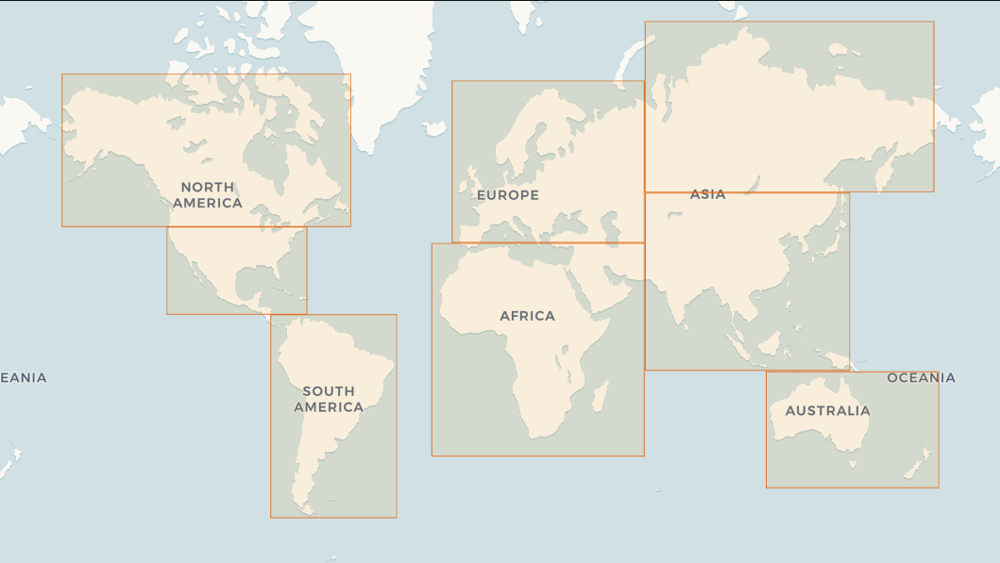

<!---
  Licensed to the Apache Software Foundation (ASF) under one
  or more contributor license agreements.  See the NOTICE file
  distributed with this work for additional information
  regarding copyright ownership.  The ASF licenses this file
  to you under the Apache License, Version 2.0 (the
  "License"); you may not use this file except in compliance
  with the License.  You may obtain a copy of the License at
    http://www.apache.org/licenses/LICENSE-2.0
  Unless required by applicable law or agreed to in writing,
  software distributed under the License is distributed on an
  "AS IS" BASIS, WITHOUT WARRANTIES OR CONDITIONS OF ANY
  KIND, either express or implied.  See the License for the
  specific language governing permissions and limitations
  under the License.
-->

# SpatialBench Datasets and Generators

This page describes the SpatialBench datasets and shows you how to use the generators to create the spatial tables.

SpatialBench is a geospatial benchmark designed for evaluating and optimizing spatial query performance in data systems. Inspired by the Star Schema Benchmark (SSB) and the New York City Taxi and Limousine Commission (NYC TLC) dataset, SpatialBench blends realistic urban mobility scenarios with standardized benchmarking practices.

The benchmark adopts the familiar star schema structure from SSB, augmented with spatial attributes such as pickup and dropoff points, spatial polygon boundaries for zones, and building footprints. These spatial enhancements allow SpatialBench to effectively test geospatial operations, including spatial joins, distance-based queries, spatial aggregations, and point-in-polygon analyses.

By combining the systematic approach of SSB with authentic, real-world scenarios drawn from NYC TLC data, SpatialBench provides meaningful and practical benchmarks relevant to urban mobility and spatial analytics workloads.

## Data model

SpatialBench tables:

* **Trip (Fact Table)**: Records individual trips, including spatial attributes (pickup and dropoff points), trip fare, distance, duration, and timestamps for pickup and dropoff.
* **Customer**: Represents customers who book trips.
* **Driver**: Represents drivers who fulfill trips.
* **Vehicle**: Details about vehicles used for trips.
* **Zone**: Polygon boundaries representing city areas or zones.
* **Building**: Polygon footprints representing building locations, types, and names.

| **Table** | **Type** | **Abbr.** | **Primary Role** | **Spatial Attributes** | **Size per Scale Factor (SF)** |
|-----------|----------|-----------|------------------|------------------------|--------------------------------|
| Building | Dimension | b_ | Polygon footprints representing building locations | Polygon footprints | 20K × (1 + log₂(SF)) |
| Customer | Dimension | c_ | Represents customers | None | 30K × SF |
| Driver | Dimension | s_ | Represents drivers | None | 500 x SF |
| Trip | Fact Table | t_ | Records individual trips | Pickup/Dropoff Points (location) | 6M × SF |
| Vehicle | Dimension | v_ | Details about vehicles | None | 100 x SF |
| Zone | Dimension | z_ | Polygon boundaries for city zones | Polygon boundaries | Tiered by SF range (see below) |

### Zone Table Scaling

| **Scale Factor (SF)** | **Zone Subtypes Included** | **Zone Cardinality** |
|----------------------|----------------------------|---------------------|
| [0, 10) | microhood, macrohood, county | 156,095 |
| [10, 100) | + neighborhood | 455,711 |
| [100, 1000) | + localadmin, locality, region, dependency | 1,035,371 |
| [1000+) | + country | 1,035,749 |


### **Geographic Coverage**

Spatial Bench's data generator uses continent-bounded affines. Each continent is defined by a bounding polygon, ensuring generation mostly covers land areas and introducing the natural skew of real geographies.

Bounding polygons:

| Region | Bounding Polygon |
|--------|------------------|
| Africa | `POLYGON ((-20.062752 -40.044425, 64.131567 -40.044425, 64.131567 37.579421, -20.062752 37.579421, -20.062752 -40.044425))` |
| Europe | `POLYGON ((-11.964479 37.926872, 64.144374 37.926872, 64.144374 71.82884, -11.964479 71.82884, -11.964479 37.926872))` |
| South Asia | `POLYGON ((64.58354 -9.709049, 145.526096 -9.709049, 145.526096 51.672557, 64.58354 51.672557, 64.58354 -9.709049))` |
| North Asia | `POLYGON ((64.495655 51.944267, 178.834704 51.944267, 178.834704 77.897255, 64.495655 77.897255, 64.495655 51.944267))` |
| Oceania | `POLYGON ((112.481901 -48.980212, 180.768942 -48.980212, 180.768942 -10.228433, 112.481901 -10.228433, 112.481901 -48.980212))` |
| South America | `POLYGON ((-83.833822 -56.170016, -33.904338 -56.170016, -33.904338 12.211188, -83.833822 12.211188, -83.833822 -56.170016))` |
| South North America | `POLYGON ((-124.890724 12.382931, -69.511192 12.382931, -69.511192 42.55308, -124.890724 42.55308, -124.890724 12.382931))` |
| North North America | `POLYGON ((-166.478008 42.681087, -52.053245 42.681087, -52.053245 72.659041, -166.478008 72.659041, -166.478008 42.681087))` |



### Distribution Options

By default, SpatialBench generates points using continent-bounded affines with a Hierarchical Thomas distribution for the trip and building tables.  

For more realism, you can choose from a variety of spatial distributions when generating tables:

* Uniform: Evenly spread points in the unit square.  
* Normal: Gaussian spread around a mean with configurable variance.  
* Diagonal: Points concentrated along the y=x diagonal with configurable buffer.  
* Bit: Recursive grid-like pattern controlled by probability and bit depth.  
* Sierpinski: Self-similar fractal pattern for highly skewed coverage.  
* Thomas: Clustered distribution with realistic hotspots and heavy-tailed skew.  
* Hierarchical Thomas: Multi-level clustering (cities → neighborhoods → points), useful for mimicking urban settlement patterns.

These options let you tailor the spatial skew to your benchmarking needs.  

See the distributions page to learn more about the supported spatial distributions, the parameters that control them, and how they impact the data.


## Data generators

You can generate the tables for Scale Factor 1 with the following command:

```
spatialbench-cli -s 1 --format=parquet --output-dir sf1-parquet
```

Here are the contents of the `sf1-parquet` directory:

* `building.parquet`
* `customer.parquet`
* `driver.parquet`
* `trip.parquet`
* `vehicle.parquet`
* `zone.parquet`

See [the README](https://github.com/apache/sedona-spatialbench) for a full description of how to use the SpatialBench data generators.
